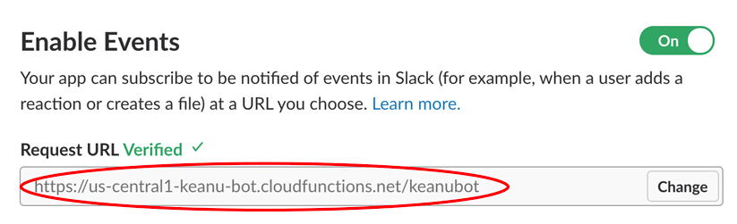
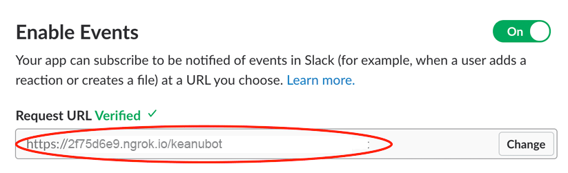
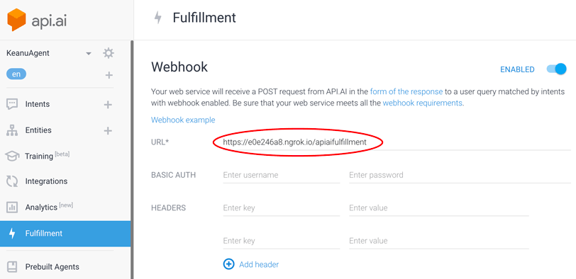

# KeanuBot

Let the most excellent Keanu Reeves improve your Slack conversations.


## Overview
The bot consists of three parts:

### 1. Event notification Cloud Function
A [Google Cloud Function](https://cloud.google.com/functions)
that Slack calls whenever a given slack event occurs (e.g. message
posted to chat). This function then invokes API.AI to do Natural
Language Processing.

### 2. API.AI
API.AI takes raw text and converts it into _intents_, _actions_,
and _entities_. It can either respond directly with messages, or
hand off to a _fulfillment webhook_ for additional processing.

### 3. Fulfillment webhook Cloud Function
After API.AI has validated and converted a chat message into
explicit _actions_ and _entities_, it can call an HTTP webhook
(Google Cloud Function) so we we can apply our business logic
to those entities. This generates a response and sends it back
to API.AI, which in turn calls the original Cloud Function to post
a message to Slack.


## Setup: Slack, API.AI, and Google Cloud Platform

1. [Create a Slack App](./docs/slack.md) and install it on your team.

1. Create a [Google Cloud Platform project](https://console.cloud.google.com).

1. [Create an API.AI project](./docs/apiai.md).

## Setup: Google Cloud Platform

1. [Create a Cloud Storage bucket](https://console.cloud.google.com/storage/create-bucket) to hold your Cloud Functions code. You can name it the same as your Cloud Project.

1. Clone this repository to your local workstation:
```$ git clone https://github.com/bretmcg/keanubot ```
1. Using your Slack and API.AI credentials, copy `functions/.env.sample` to
`functions/.env` and add the correct values.

    ### Config Variables - .env
    Name | Description
    ---|---
    `APIAI_TOKEN` | The API.AI [access token](https://docs.api.ai/docs/authentication)
    `SLACK_BOT_TOKEN` | The Slack Bot OAuth token. _Slack Developers Console_ > _OAuth & Permissions_ > _Bot User OAuth Access Token_
    `SLACK_VERIFICATION_TOKEN` | The Slack verification token. _Slack Developer's Console_ > _Basic Information_ > _Verification Token_

1. Deploy the event notification function `keanubot` to Cloud Functions:
```
cd functions/
```
```
gcloud beta functions deploy keanubot --stage-bucket <YOUR_CLOUD_STORAGE_BUCKET> --trigger-http
```
5. Add the ```keanubot``` function URL to the Slack event subscription page. It should be in the format `https://REGION-PROJECT.cloudfunctions.net/keanubot`.

1. Deploy the API.AI fulfillment webhook.
```
gcloud beta functions deploy apiaifulfillment --stage-bucket <YOUR_CLOUD_STORAGE_BUCKET> --trigger-http
```
7. Add the ```apiaifulfillment``` function URL to the API.API *Fulfillment* page, and make sure Webhook is *Enabled.*


1. Invite your bot into a channel and watch it respond to you!


## Local development and testing
1. ```$ cd functions/```
1. ```$ npm install```
1. Add security token values to ```.env``` as before.
1. ```$ node server.js```
1. In a new terminal window:
    1. [Download ngrok](https://ngrok.com/download) and unzip into the
    ```functions/``` directory.
    1. From ```functions/``` run ```$ ngrok http 3005```
2. Slack event subscription: add the local ```keanubot``` URL to the Slack app page. It should be in the format `https://2f75d6e9.ngrok.io/keanubot`.

2. API.AI fulfillment URL: Add the local ```apiaifulfillment``` URL to the API.API *Fulfillment* page, and make sure Webhook is *Enabled.* The URL should be in the format `https://2f75d6e9.ngrok.io/apiaifulfillment`


