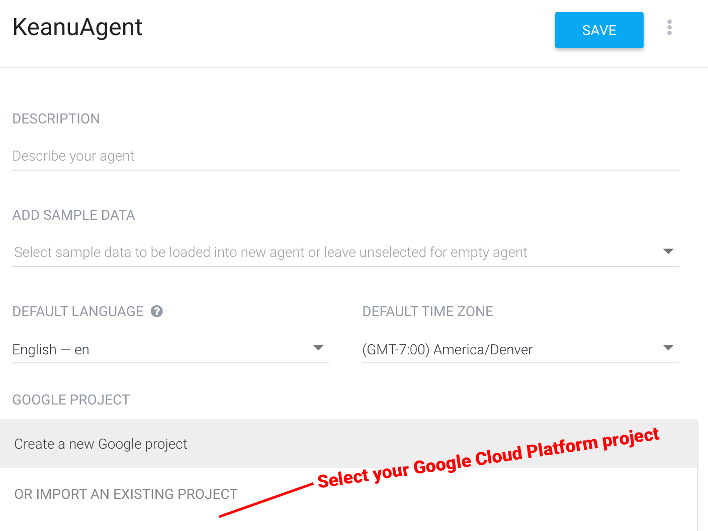
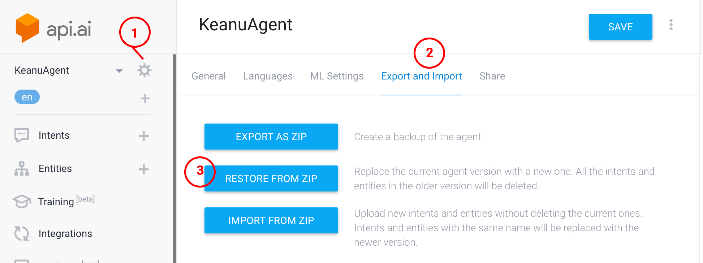
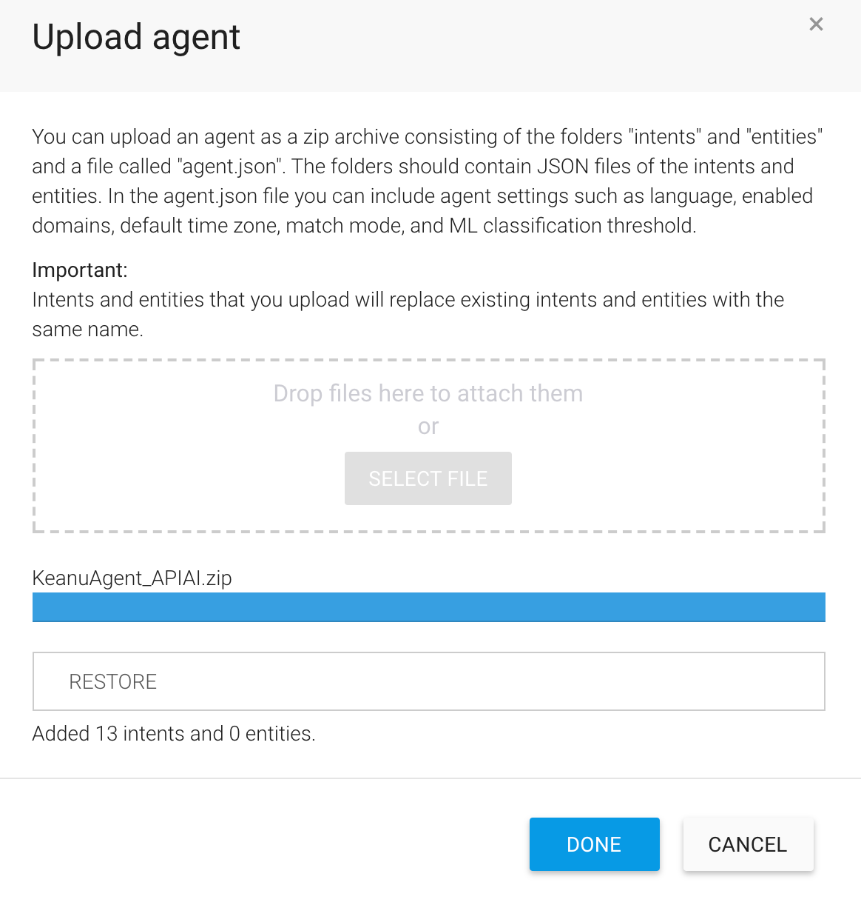

## Create an API.AI project
1. Create an [API.AI project](https://console.api.ai/) using Sign in with Google. This will link your Google Cloud Platform account with API.AI.

## Import intents

## Select .zip from GitHub repo

