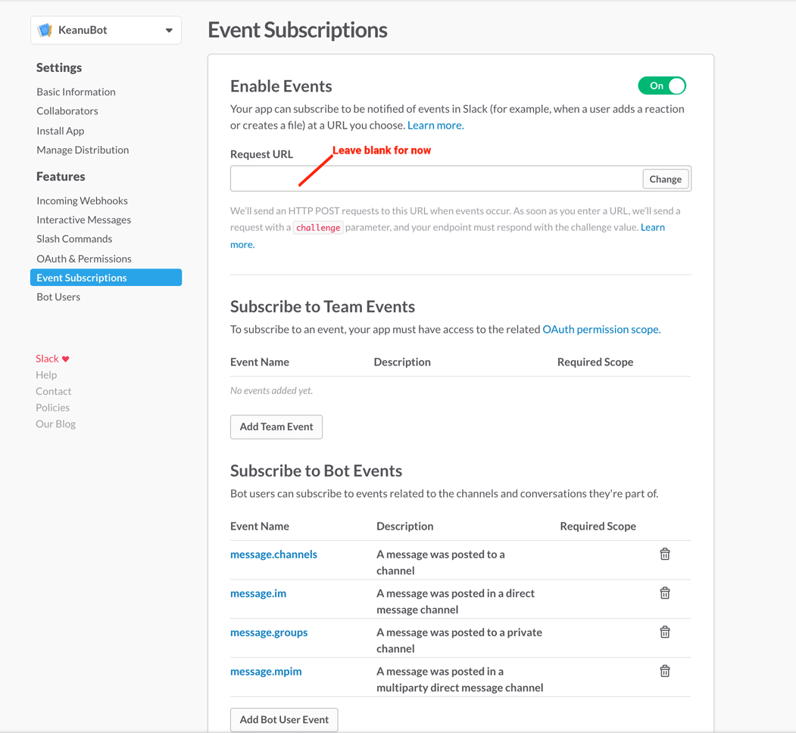

## Create a Slack workspace
Skip this step if you already have a Slack workspace. Or, [create a new workspace](https://slack.com/create).

## Create a Slack App
Go to [https://api.slack.com/apps](https://api.slack.com/apps)

## Add a Bot

## Subscribe to Events

## Install the App

## Tokens :robot:

